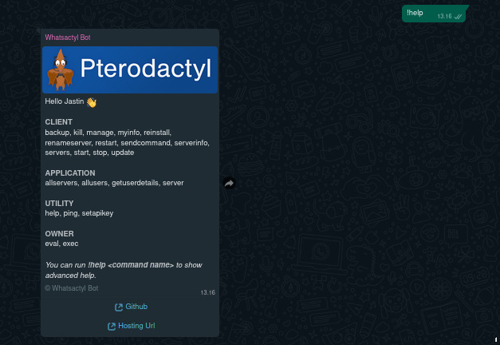

# whatsactyl

_A bot to manage Pterodactyl panels via whatsapp!_

Many thanks to [ThisMe124](https://github.com/ThisMe124) for contributing so much to building this bot from scratch.

For now, maybe there are still many shortcomings, such as the command is not fully available for category applications and others, we really welcome if there are contributors who want to build this bot together.

> Bots will run better when used in private messages instead of in groups... But it's up to you!

## Instalation
- Clone this repository
```cli
git clone https://github.com/JastinXyz/whatsactyl
```
- Install the dependencies
```cli
npm install
```
- Fill in the configuration in [config.json]('./config.json') (See the configuration details [HERE](#Configuration))
- Run the bot
```cli
node .
```
- Scan the QR
- Enjoy!

## Showcase



## Configuration
Refer to [config.json]('./config.json')
```json
{
  "prefix": "!",
  "autoread": true,
  "mongodb": "",
  "ownerNumber": [""],
  "host": "https://domain.tld",
  "application": {
    "api_key": ""
  },
  "serverCreate": {
    "nestId": "",
    "ram": "",
    "disk": "",
    "cpu": "",
    "limits": {
      "db": "",
      "backups": "",
      "allocations": ""
    },
    "egg": [
      {
        "eggId": "",
        "environment": {
          "NAME": "VALUE",
        }
      },
      {
        "eggId": "",
        "environment": {
          "NAME": "VALUE",
        }
      }
    ]
  }
}

```

| Object | Type | Description |
|--------|------|-------------|
| prefix | `String` | your bot prefix |
| autoread | `String` | whether the bot will automatically mark the message as read. |
| mongodb | `String` | MongoDB database url |
| ownerNumber | `Array` | List of numbers that can run commands in the category owner. |
| host | `String` | url to your host **(must use http:// or https:// as a prefix and at the end there is no slash but the last letter of your TLD)** |
| application.api_key | `String` | Your panel's API Key. This can be overridden using the `setapikey` command later. |
| serverCreate.nestId | `Number` | ID nest in which there is an egg which will later be placed on `serverCreate.egg` |
| serverCreate.ram | `Number` | The amount of ram for each server that will be created with the command. (MB) |
| serverCreate.disk | `Number` | The amount of disk for each server that will be created with the command. (MB) |
| serverCreate.cpu | `Number` | The amount of cpu for each server that will be created with the command. (like `100`, `50`, etc)
| serverCreate.limits.[db, backups, allocations] | `Number` | How many limits are there for the backup, database, and allocations features. |
| serverCreate.egg | `Array` | Fill in the array with the objects that have been sampled in there. This is very much needed for the create server command. EggId is the id of the egg, and environment is the startup variables that are needed by the egg itself. |

## Contributors
<a href="https://github.com/JastinXyz/whatsactyl/graphs/contributors">
  
</a>

<hr/>
<div align="center">

_⭐️ it if you 👍️ it_ <br/>
_Minimal star atau fork bang kalo mau gunain_

</div>
